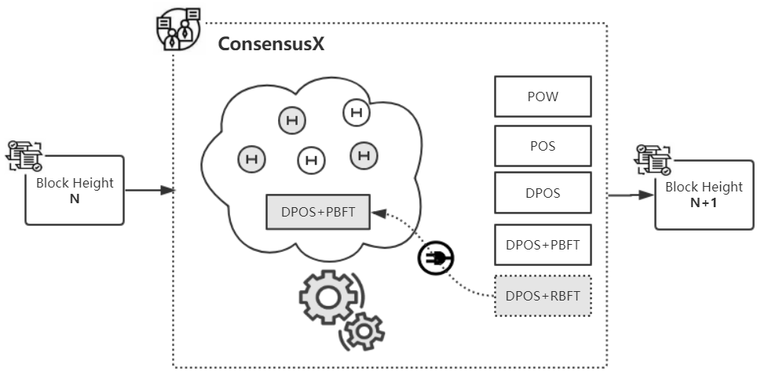

# ConsensusX

## Introduction

- Once a consensus algorithm has to be changed during blockchain operation, in order to adopt a different business scenario, the ConsensusX can immediately switch the original algorithm into others. In the case that DPoS was chosen, the Dynamic Node mechanism could also help with the node's quantity adjustment. This fast and easy pluggability greatly reduces the risk of false algorithm selection in the early stage, and it also provides an efficient, flexible and low-cost blockchain solution for enterprises.  

## FrameWork Diagram 

## Consensus Loading Mechanism

ConsensusX prefabricated two types of consensus loading mechanisms：

**Scenario 1**: For prefabricated consensus algorithms, such as PoW, PoS, DPoS, etc., when the proposal is voted through, the main-net consensus algorithm is switched at the specified block height. The node smoothly produces the block under the new consensus algorithm, and the nodes of the whole network synchronously update the data;

**Scenario 2**: If the node does not have a prefabricated consensus algorithm, some of the producer nodes in the whole-net run out in turn, and the nodes on the offline line load the new algorithm in batches until all the nodes in the whole network are loaded with a new consensus algorithm. The offline node loads the new algorithm in batches until all nodes on the entire network are loaded with a new consensus algorithm.
